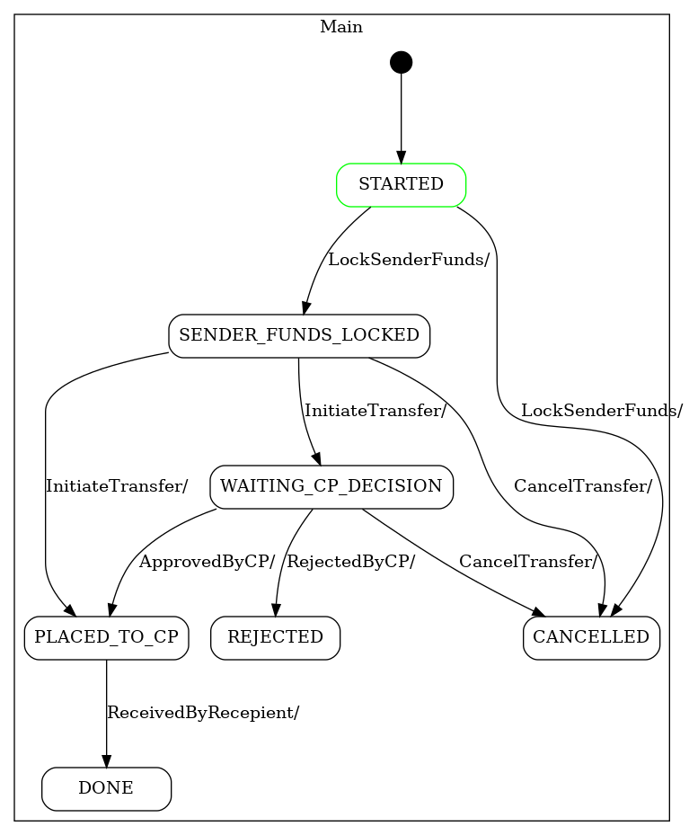
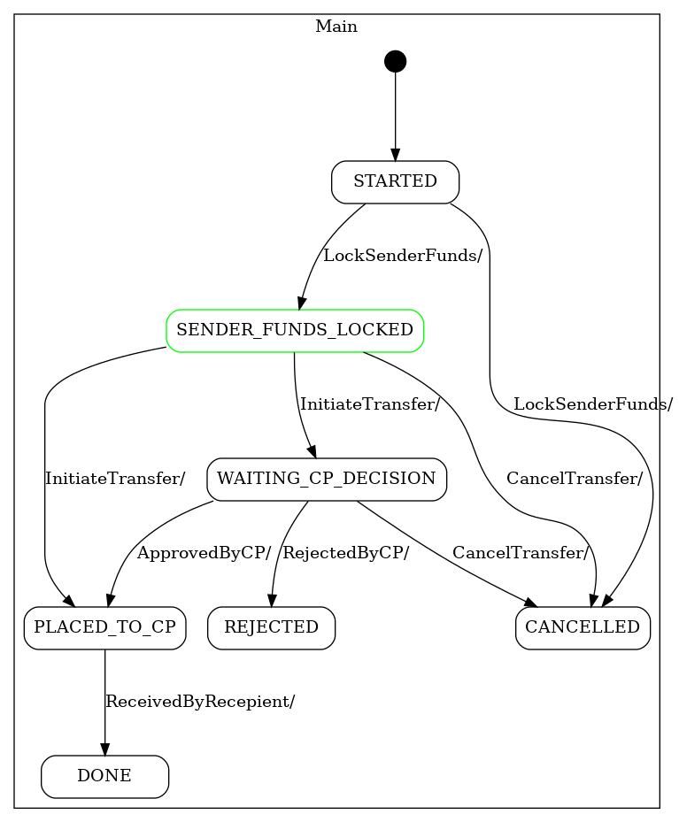
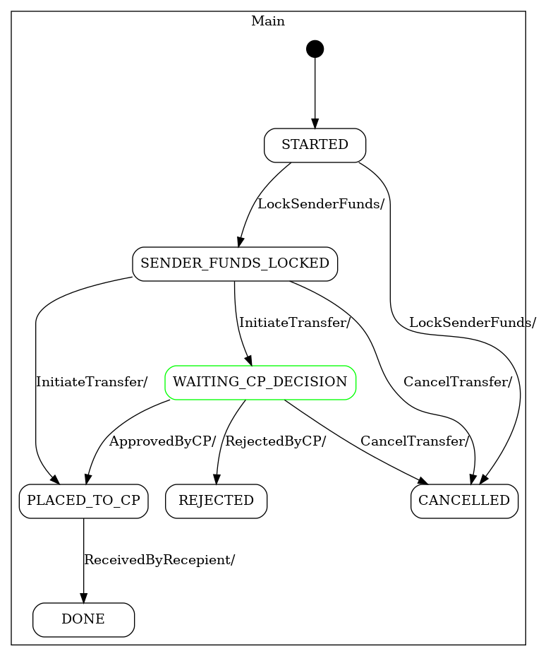
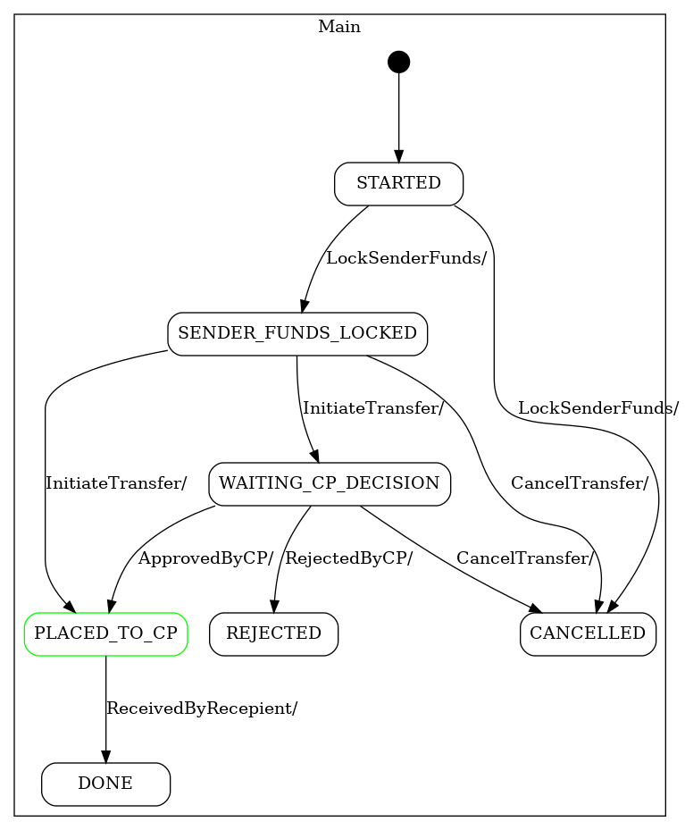
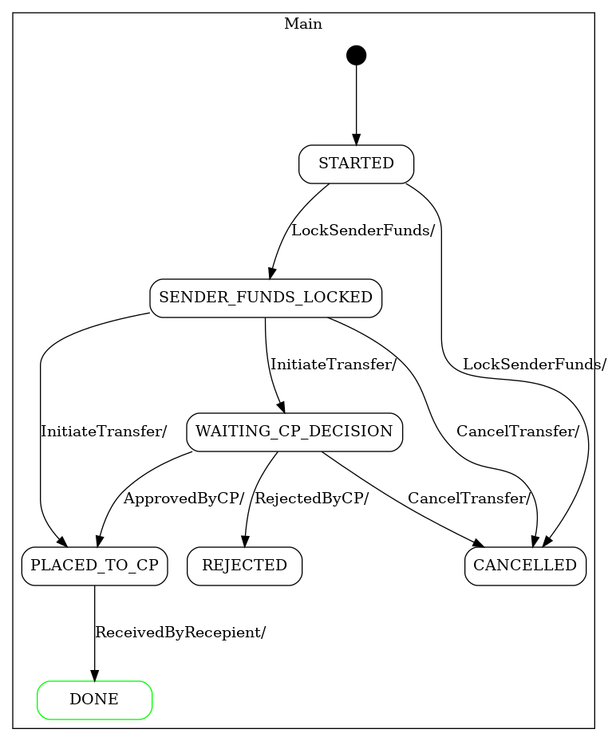

WF with an embedded FSM
---

This is a demo workflow that show how FSM can be used inside temporal workflow 

Prerequisites
---
1. FSM jar should be in maven repo (local or remote)
2. Docker image for rendering dot files and state colorization should be accessible

Build
---

    mvn install

Visual verification
---

target/ directory should contain state visualizations like those:

